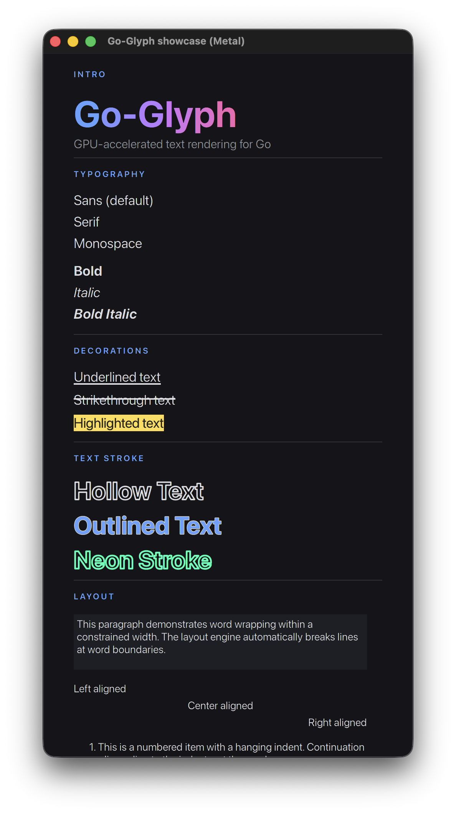
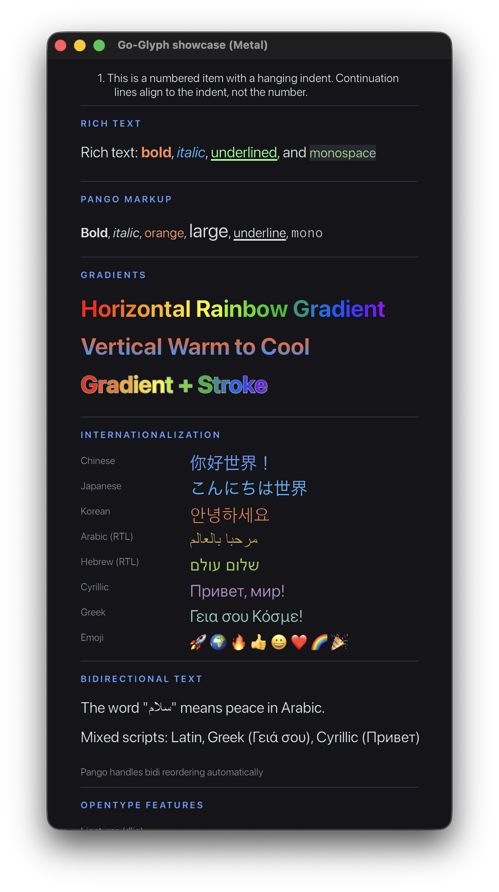
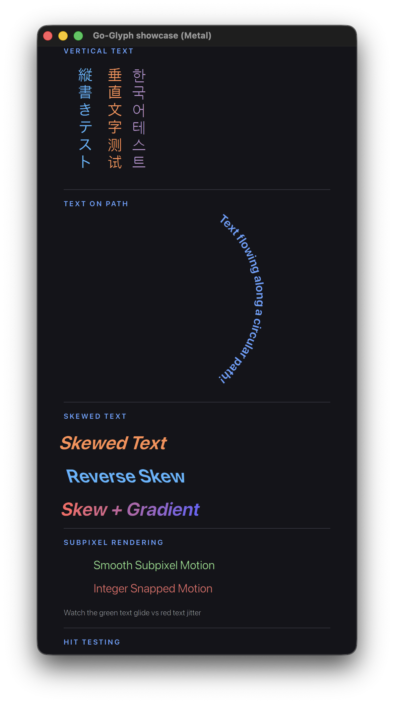

# Go-Glyph


[](https://deepwiki.com/mike-ward/go-glyph)

High-performance text rendering library for Go. Uses Pango, FreeType,
and FontConfig on Linux/macOS; native GDI on Windows; CoreText on iOS.
Provides text shaping, layout, rasterization, and editing with
pluggable rendering backends.



## Features

- **Text shaping** via Pango - full Unicode, BiDi, complex scripts
- **Glyph rasterization** via FreeType2 with subpixel positioning
- **Multi-page glyph atlas** with automatic packing and eviction
- **Layout caching** for efficient per-frame rendering
- **Rich text** - mixed fonts, sizes, colors, and styles in one block
- **Pango markup** support for inline styling
- **Text decorations** - underline, strikethrough, stroke/outline
- **Gradient text** - horizontal and vertical color gradients
- **Word wrapping** with word, character, and word-char modes
- **Text alignment** - left, center, right
- **Affine transforms** - rotation, skew, scale, translation
- **Glyph placements** - per-glyph positioning (text on a path)
- **Hit testing** and cursor position queries
- **Text mutation** - insert, delete, selection, undo/redo
- **IME support** with composition/preedit rendering
- **Accessibility** - screen reader announcements, text field nodes
- **Pluggable backends** - Ebitengine, SDL2, GPU (Metal/OpenGL)

## Prerequisites

Go-Glyph uses CGo bindings to the following C libraries:

- Pango (+ PangoFT2)
- FreeType2
- FontConfig
- GLib
- SDL2 (for SDL2 and GPU backends)

### Windows (MSYS2)

The root package and Ebitengine backend require no native libraries
on Windows (`CGO_ENABLED=0`). The SDL2 and GPU backends need SDL2
via [MSYS2](https://www.msys2.org):

```sh
pacman -S mingw-w64-x86_64-SDL2 mingw-w64-x86_64-pkg-config
```

Build from an MSYS2 MinGW 64-bit shell, or add the MinGW `bin/`
directory to `PATH` so `pkg-config` and the SDL2 DLL are found.

### macOS (Homebrew)

```sh
brew install pango freetype fontconfig glib sdl2
```

### Ubuntu / Debian

```sh
sudo apt install libpango1.0-dev libfreetype-dev \
    libfontconfig1-dev libglib2.0-dev libsdl2-dev
```

### Fedora

```sh
sudo dnf install pango-devel freetype-devel \
    fontconfig-devel glib2-devel SDL2-devel
```

## Installation

```sh
go get github.com/mike-ward/go-glyph@latest
```

## Quick Start

Minimal Ebitengine example:

```go
package main

import (
    "log"

    "github.com/hajimehoshi/ebiten/v2"
    "github.com/mike-ward/go-glyph"
    glyphebi "github.com/mike-ward/go-glyph/backend/ebitengine"
)

type Game struct {
    ts      *glyph.TextSystem
    backend *glyphebi.Backend
}

func (g *Game) Update() error { return nil }

func (g *Game) Draw(screen *ebiten.Image) {
    g.backend.SetTarget(screen)

    _ = g.ts.DrawText(20, 20, "Hello, World!", glyph.TextConfig{
        Style: glyph.TextStyle{
            FontName: "Sans 24",
            Color:    glyph.Color{A: 255},
        },
    })

    g.ts.Commit()
}

func (g *Game) Layout(w, h int) (int, int) { return w, h }

func main() {
    scale := ebiten.Monitor().DeviceScaleFactor()
    backend := glyphebi.New(nil, float32(scale))

    ts, err := glyph.NewTextSystem(backend)
    if err != nil {
        log.Fatal(err)
    }
    defer ts.Free()

    ebiten.SetWindowSize(800, 600)
    if err := ebiten.RunGame(&Game{ts: ts, backend: backend}); err != nil {
        log.Fatal(err)
    }
}
```

## Core Concepts



### TextSystem

The main entry point. Manages a `Context` (Pango/FreeType state),
a `Renderer` (glyph atlas + draw calls), and a layout cache.

```go
ts, err := glyph.NewTextSystem(backend)
defer ts.Free()

// Simple rendering (uses cache automatically):
ts.DrawText(x, y, "text", cfg)
ts.Commit() // Upload atlas textures, call once per frame.
```

For pre-computed layouts:

```go
layout, err := ts.LayoutText("text", cfg)
ts.DrawLayout(layout, x, y)
```

### TextConfig

Controls all aspects of text rendering:

```go
cfg := glyph.TextConfig{
    Style: glyph.TextStyle{
        FontName:      "Sans 16",       // Pango font description
        Typeface:      glyph.TypefaceBold,
        Color:         glyph.Color{R: 255, A: 255},
        Underline:     true,
        Strikethrough:  false,
        LetterSpacing: 2.0,             // Extra spacing (points)
        StrokeWidth:   1.5,             // Outline width (points)
        StrokeColor:   glyph.Color{A: 255},
    },
    Block: glyph.BlockStyle{
        Wrap:   glyph.WrapWord,
        Width:  400,                    // Wrap width (-1 = none)
        Align:  glyph.AlignCenter,
        Indent: 20,                     // First-line indent
    },
    UseMarkup: false,
    Gradient:  nil,
}
```

### Layout

A computed text layout containing glyph positions, line breaks,
character rectangles, and logical attributes. Created by
`LayoutText`, `LayoutRichText`, or `LayoutTextCached`.

### DrawBackend

Interface for plugging in a rendering framework:

```go
type DrawBackend interface {
    NewTexture(width, height int) TextureID
    UpdateTexture(id TextureID, data []byte)
    DeleteTexture(id TextureID)
    DrawTexturedQuad(id TextureID, src, dst Rect, c Color)
    DrawFilledRect(dst Rect, c Color)
    DrawTexturedQuadTransformed(
        id TextureID, src, dst Rect, c Color, t AffineTransform,
    )
    DPIScale() float32
}
```

## Backends

| Backend | Package | Notes |
|---------|---------|-------|
| Ebitengine | `go-glyph/backend/ebitengine` | Pure Go game engine |
| SDL2 | `go-glyph/backend/sdl2` | SDL2 renderer |
| GPU | `go-glyph/backend/gpu` | Metal (macOS), OpenGL 3.3 (Linux/Windows) |

Each backend has its own `go.mod` with framework-specific
dependencies. Import the one matching the target framework.

### Ebitengine

```go
import glyphebi "github.com/mike-ward/go-glyph/backend/ebitengine"

backend := glyphebi.New(nil, float32(dpiScale))
// Call backend.SetTarget(screen) each frame before drawing.
```

### SDL2

```go
import glyphsdl "github.com/mike-ward/go-glyph/backend/sdl2"

backend := glyphsdl.New(sdlRenderer, float32(dpiScale))
defer backend.Destroy()
```

### GPU (Metal / OpenGL)

Uses Metal on macOS and OpenGL 3.3 on Linux. The API is identical
on both platforms:

```go
import glyphgpu "github.com/mike-ward/go-glyph/backend/gpu"

// Create window with gpu.WindowFlag() (Metal or OpenGL).
window, _ := sdl.CreateWindow("demo",
    sdl.WINDOWPOS_CENTERED, sdl.WINDOWPOS_CENTERED,
    800, 600, sdl.WINDOW_SHOWN|gpu.WindowFlag())

backend, err := glyphgpu.New(sdlWindow, float32(dpiScale))
defer backend.Destroy()

// Per frame:
backend.BeginFrame()
// ... draw text ...
backend.EndFrame(0.96, 0.96, 0.96, 1.0, logicalW, logicalH)
```

## Text Styling



### Bold, Italic

```go
glyph.TextStyle{FontName: "Sans 18", Typeface: glyph.TypefaceBold}
glyph.TextStyle{FontName: "Sans 18", Typeface: glyph.TypefaceItalic}
glyph.TextStyle{FontName: "Sans 18", Typeface: glyph.TypefaceBoldItalic}
```

### Underline and Strikethrough

```go
glyph.TextStyle{FontName: "Sans 16", Underline: true}
glyph.TextStyle{FontName: "Sans 16", Strikethrough: true}
```

### Letter Spacing

```go
glyph.TextStyle{FontName: "Sans 16", LetterSpacing: 3.0}  // wider
glyph.TextStyle{FontName: "Sans 16", LetterSpacing: -1.0}  // tighter
```

### Stroke / Outline

```go
glyph.TextStyle{
    FontName:    "Sans 28",
    Color:       glyph.Color{R: 255, G: 255, B: 255, A: 255},
    StrokeWidth: 2.0,
    StrokeColor: glyph.Color{A: 255},
}
```

### Gradients

```go
cfg := glyph.TextConfig{
    Style: glyph.TextStyle{FontName: "Sans 28"},
    Gradient: &glyph.GradientConfig{
        Direction: glyph.GradientHorizontal,
        Stops: []glyph.GradientStop{
            {Color: glyph.Color{R: 255, A: 255}, Position: 0},
            {Color: glyph.Color{B: 255, A: 255}, Position: 1},
        },
    },
}
```

## Layout Features

### Word Wrapping

```go
glyph.BlockStyle{Wrap: glyph.WrapWord, Width: 300}
glyph.BlockStyle{Wrap: glyph.WrapChar, Width: 300}
glyph.BlockStyle{Wrap: glyph.WrapWordChar, Width: 300}
```

### Alignment

```go
glyph.BlockStyle{Width: 400, Align: glyph.AlignLeft}
glyph.BlockStyle{Width: 400, Align: glyph.AlignCenter}
glyph.BlockStyle{Width: 400, Align: glyph.AlignRight}
```

### Indentation

```go
glyph.BlockStyle{Width: 400, Indent: 30}   // first-line indent
glyph.BlockStyle{Width: 400, Indent: -30}  // hanging indent
```

### Rich Text

Render multiple styles in a single layout:

```go
rt := glyph.RichText{
    Runs: []glyph.StyleRun{
        {Text: "Bold ", Style: glyph.TextStyle{
            FontName: "Sans 16",
            Typeface: glyph.TypefaceBold,
            Color:    glyph.Color{A: 255},
        }},
        {Text: "and italic", Style: glyph.TextStyle{
            FontName: "Sans 16",
            Typeface: glyph.TypefaceItalic,
            Color:    glyph.Color{R: 200, A: 255},
        }},
    },
}
layout, err := ts.LayoutRichText(rt, cfg)
ts.DrawLayout(layout, x, y)
```

### Pango Markup

```go
cfg := glyph.TextConfig{
    Style:     glyph.TextStyle{FontName: "Sans 16"},
    UseMarkup: true,
}
ts.DrawText(x, y, "<b>Bold</b> and <i>italic</i>", cfg)
```

## Text Queries

All query methods operate on a pre-computed `Layout`:

```go
layout, _ := ts.LayoutText(text, cfg)

// Hit testing: byte index at screen coordinates.
idx := layout.HitTest(mouseX-originX, mouseY-originY)

// Character bounding box.
rect, ok := layout.GetCharRect(byteIndex)

// Cursor position geometry.
cursor, ok := layout.GetCursorPos(byteIndex)

// Closest byte index (clamps to text bounds).
idx = layout.GetClosestOffset(localX, localY)

// Selection rectangles.
rects := layout.GetSelectionRects(start, end)

// Cursor navigation.
next := layout.MoveCursorRight(byteIndex)
prev := layout.MoveCursorLeft(byteIndex)
wordNext := layout.MoveCursorWordRight(byteIndex)
wordPrev := layout.MoveCursorWordLeft(byteIndex)
lineStart := layout.MoveCursorLineStart(byteIndex)
lineEnd := layout.MoveCursorLineEnd(byteIndex)
up := layout.MoveCursorUp(byteIndex, preferredX)
down := layout.MoveCursorDown(byteIndex, preferredX)

// Word / paragraph boundaries.
start, end := layout.GetWordAtIndex(byteIndex)
pStart, pEnd := layout.GetParagraphAtIndex(byteIndex, text)
```

## Text Mutation

Package-level functions for editing text:

```go
// Insert and delete.
result := glyph.InsertText(text, cursor, "hello")
result = glyph.DeleteBackward(text, layout, cursor)
result = glyph.DeleteForward(text, layout, cursor)

// Word/line deletion.
result = glyph.DeleteToWordBoundary(text, layout, cursor)
result = glyph.DeleteToWordEnd(text, layout, cursor)
result = glyph.DeleteToLineStart(text, layout, cursor)
result = glyph.DeleteToLineEnd(text, layout, cursor)

// Selection operations.
result = glyph.DeleteSelection(text, cursor, anchor)
result = glyph.InsertReplacingSelection(text, cursor, anchor, "new")
selected := glyph.GetSelectedText(text, cursor, anchor)
clipboard, result := glyph.CutSelection(text, cursor, anchor)
```

### Undo / Redo

```go
um := glyph.NewUndoManager(100)

// After each mutation:
um.RecordMutation(result, insertedText, cursorBefore, anchorBefore)

// Undo / redo:
if undoResult := um.Undo(currentText); undoResult != nil {
    text = undoResult.Text
    cursor = undoResult.Cursor
}
if redoResult := um.Redo(currentText); redoResult != nil {
    text = redoResult.Text
    cursor = redoResult.Cursor
}
```

## Advanced Rendering

### Affine Transforms

```go
transform := glyph.AffineRotation(0.3).
    Multiply(glyph.AffineSkew(0.2, 0))

ts.DrawLayoutTransformed(layout, x, y, transform)
```

### Rotated Text

```go
ts.DrawLayoutRotated(layout, x, y, angleRadians)
```

### Glyph Placements (Text on a Path)

Position each glyph independently:

```go
glyphs := layout.GlyphPositions()
placements := make([]glyph.GlyphPlacement, len(glyphs))
for i, g := range glyphs {
    t := float64(g.X) / totalWidth
    placements[i] = glyph.GlyphPlacement{
        X:     pathX(t),
        Y:     pathY(t),
        Angle: pathAngle(t),
    }
}
ts.DrawLayoutPlaced(layout, placements)
```

### Subpixel Rendering

Glyph positions use subpixel offsets for smooth text at all sizes.
The renderer quantizes to 4 horizontal subpixel bins.

## Subsystems

### IME (Input Method Editor)

The `ime` package provides a `Bridge` interface for platform-native
IME integration. Composition state (preedit text, clause styling,
cursor offset) is tracked in `CompositionState` and rendered with
clause underlines and cursor feedback.

### Accessibility

The `accessibility` package provides a `Manager` for building an
accessibility tree with text nodes and text field nodes.
An `Announcer` handles screen reader announcements (character echo,
word echo, line changes, selection changes) with debouncing.

## Examples

| Example | Description |
|---------|-------------|
| `examples/demo` | Ebitengine demo - basic text, styles, wrapping, emoji, CJK, RTL |
| `examples/demo_sdl2` | Same demo using SDL2 backend |
| `examples/demo_gpu` | Same demo using GPU backend (Metal/OpenGL) |
| `examples/showcase_gpu` | Feature gallery (22 sections) |

Run an example:

```sh
cd examples/demo && go run .
```

## Architecture

```
TextSystem
  +-- Context (platform text engine)
  |     +-- Text shaping and layout computation
  |     +-- Font resolution and metrics
  +-- Renderer
  |     +-- GlyphAtlas (multi-page, shelf-packed)
  |     +-- Glyph rasterization and caching
  |     +-- Draw call emission (5-pass pipeline)
  +-- Layout cache (hash-keyed, time-based eviction)
  +-- DrawBackend (interface)
        +-- Ebitengine / SDL2 / GPU implementations
```

The rendering pipeline per layout:

1. Background rectangles
2. Stroke setup
3. Stroke outlines
4. Fill glyphs (with subpixel positioning, emoji scaling, gradients)
5. Decorations (underline, strikethrough)

## Wiki Documentation

https://deepwiki.com/mike-ward/go-glyph/8-glossary

## License

See [LICENSE](LICENSE) for details.
